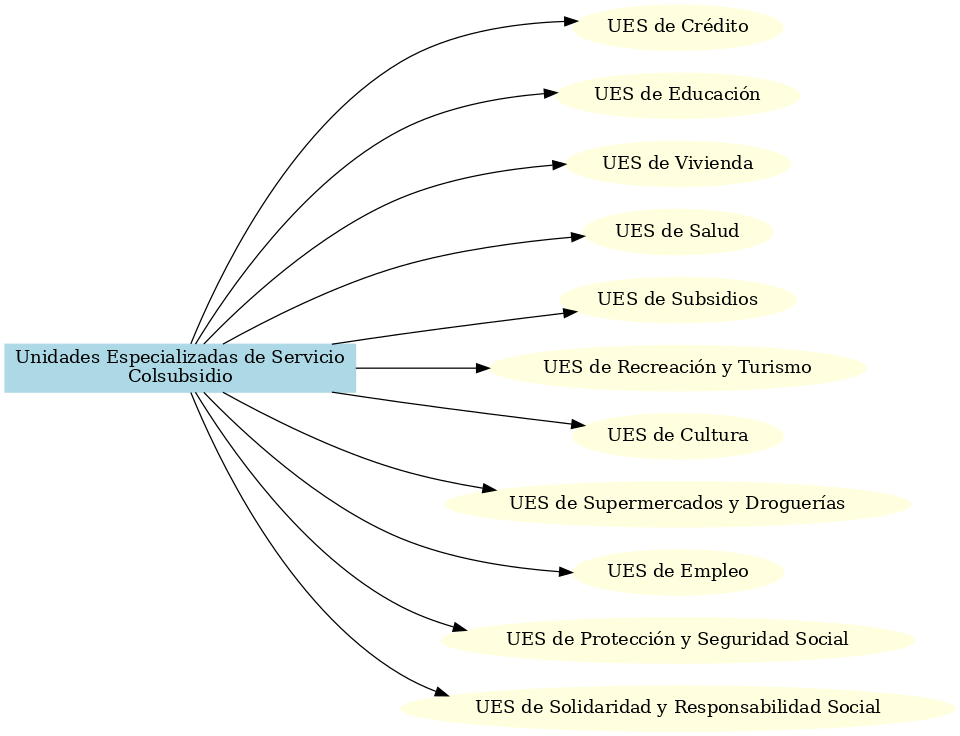
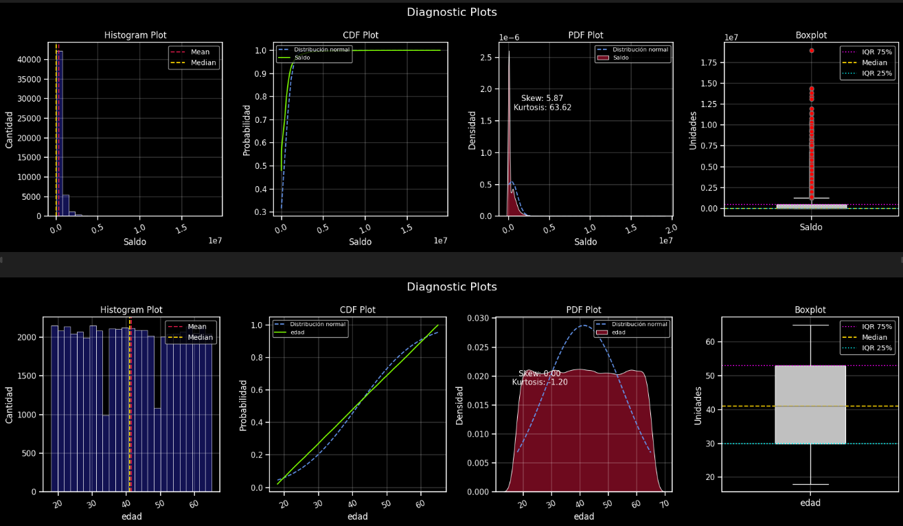
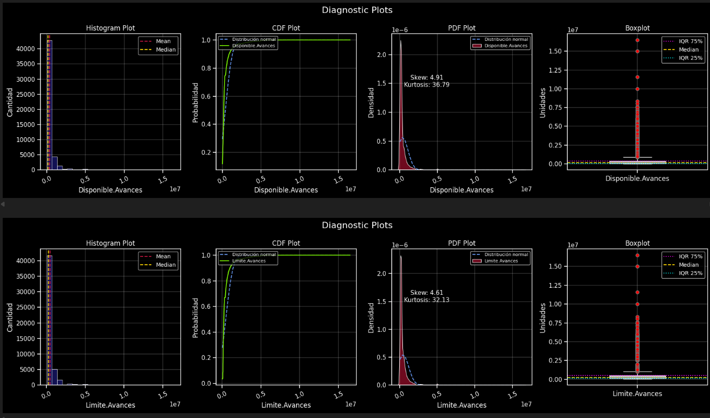
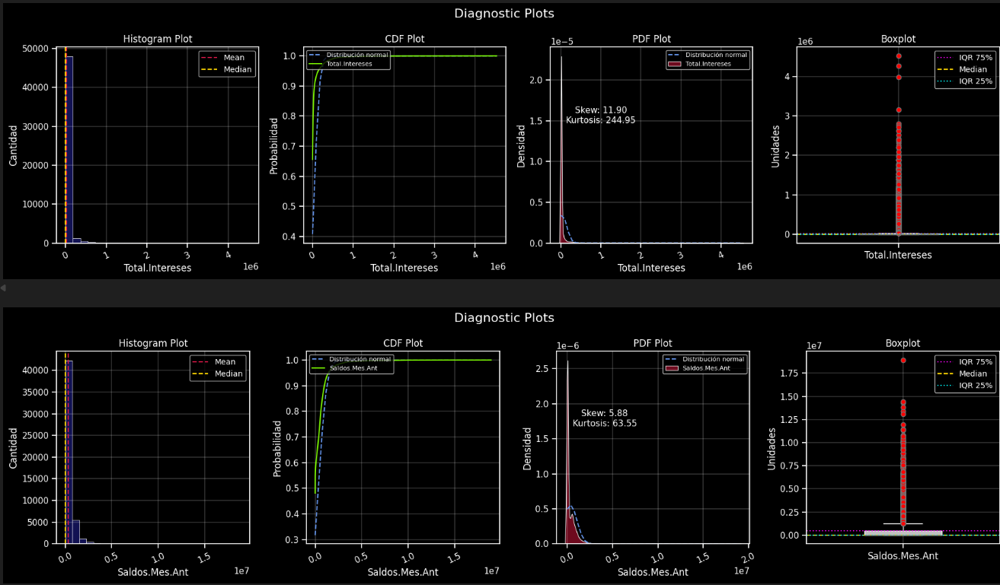

<div align="center">

# Desarrollo prueba técnica Colsubsidio

**Responsable:** Wuilson Adolfo Estacio Rojas<br/>  
**Analista de incorporación:** Yeimmy Verónica Bustos Moreno<br/> 
**Jefe gestión de la información:** Camilo Garzón Márquez<br/> 
**Fecha:** 15-09-2025  

</div>


# Prueba Tecnica Cientifico de Datos - Colsubsidio 

Este documento describe el proceso seguido para **explorar** los datos, **identificar** variables relevantes y **definir** un modelo heurístico para solucionar cada uno de los puntos planteados en la prueba tecnica.


## Tabla de Contenido
1. [Introducción](#introducción)  
2. [Objetivo](#objetivo)  
3. [Modelo de Fuga](#modelo-de-fuga)  
   - 3.1 [Exploración y Evaluación de Datos (EDA)](#eda)  
     - 3.1.1 [Data Quality](#data-quality)  
     - 3.1.2 [Estadísticas y descriptivos](#estadísticas-descriptivas)  
   - 3.2 [Definición del Modelo](#Definición-del-Modelo)
     - 3.2.1 [Flujo Datos](#Flujo-Datos)  
4. [Ejercicios de numeral Dos](#ejercicios-de-numeral-dos)  
5. [Análisis de punto 3](#análisis-de-punto-3)


## introduccion

### ¿Qué es Colsubsidio?

Es una **Caja de Compensación Familiar en Colombia**, entidad privada, de naturaleza social y sin ánimo de lucro, que administra recursos del subsidio familiar y presta servicios a trabajadores y sus familias en distintos sectores.  

Colsubsidio fue fundada en **1957**, por lo que lleva alrededor de **68 años** en funcionamiento en Colombia.  

Su objetivo principal es **mejorar la calidad de vida de los trabajadores afiliados y sus familias**.  
Para ello ha dividido la prestación de sus servicios en **once Unidades Especializadas de Servicio (UES)**.  

Una de ellas, la **UES de Crédito**, atiende las necesidades de la población (afiliados y no afiliados) a través de productos crediticios como: **cupo, consumo e hipotecario**, a nivel nacional.  

Pero existen otras UES, como se muestra en la siguiente imagen:  

<p align="center">
  
</p>

---

## Objetivo
El objetivo de la prueba es idear una solución para el punto uno que es el Modelo de Fuga dado en el documento Data_Scientist_Test_2023.html el cual tiene un  peso del 75%, tambien la solucion de cualquiera de los puntos del numeral dos con un peso del 15% y finalizar con el desarrollo del numeral 3 con un peso del 10%


---

# Modelo-de-fuga

### Objetivo: En este caso, se requiere establecer la probabilidad que un cliente en una de sus líneas de negocio (Crédito) se vaya o no. Para esto se tiene un histórico de datos de los clientes que han solicitado un tipo de retiro y los que no lo han expresado.

## 📑 Columnas Relevantes

### BASE: train

- **id** → Identificación Única  
- **Fecha.Expedicion** → Fecha expedición del cupo  
- **Cancelacion** → Tipo Cancelación  
- **Gestionable** → Describe si es posible gestionar o no la identificación (*Gestionable / No Gestionable*)  
- **Retencion** → Se realizó una retención o no *(No cuenta para test)*  
- **TIPO** → Tipo de tarjeta  
- **ANO_MES** → Año mes de la intención de cancelación  
- **Target** → Variable Objetivo o Target *(No cuenta para test)*  
- **Fecha.Proceso** → Fecha análisis de la base  
- **Disponible.Avances** → Saldo disponible para avances de efectivo  
- **Limite.Avances** → Saldo límite para avances de efectivo  
- **Total.Intereses** → Total intereses pagados mes análisis  
- **Saldos.Mes.Ant** → Saldo del mes anterior  
- **Pagos.Mes.Ant** → Valor en COP de los pagos del mes anterior  
- **Vtas.Mes.Ant** → Consumo mes anterior  
- **Edad.Mora** → Días en mora  
- **Limite.Cupo** → Cupo límite  
- **Pago.del.Mes** → Valor en COP de los pagos del mes  
- **Pago.Minimo** → Valor en COP del pago mínimo  
- **Vr.Mora** → Valor en COP de la mora  
- **Vr.Cuota.Manejo** → Valor de la cuota de manejo  
- **Saldo** → Saldo disponible en el mes de análisis  

---

### BASE: test_demograficas

- **id** → Identificación Única  
- **categoria** → Categoría de afiliado a la caja Colsubsidio  
- **segmento** → Segmento poblacional *(según modelo analítico desarrollado en la caja)*  
- **edad** → Edad en años  
- **nivel_educativo** → Nivel educativo *(Sin definir, primaria, secundaria, profesional, posgrado)*  
- **estado_civil** → Estado civil actual  
- **Genero** → Género  
- **PAC** → Número de personas a cargo  
- **contrato** → Tipo de contrato *(1: Fijo, 2: Indefinido, 3: Prestación Servicios, 4: Independiente)*  
- **estrato** → Estrato socioeconómico  

---

### BASE: test_subsidio

- **cuota_monetaria** → (1: Tiene derecho a cuota monetaria, 2: No tiene derecho)  
- **sub_vivenda** → (1: Ha solicitado y desembolsado subsidio de vivienda, 2: No ha solicitado)  
- **bono_lonchera** → (1: Tiene derecho a Bono Lonchera, 2: No tiene derecho)  
---


## EDA
Para este modelo de fuga inicialmente para ello cargamos los datos de train (train_test_demograficas,train_test_subsidios, train) para la exploracion de los datos, con un total de 50001 clientes unicos o Id unicos, esta exploracion se realiza en el cuaderdo de python Modelo de Fuga -eda

### Data-Quality
1 Valores nulos se identificaron solo en la siguientes colunas:
- Gestionable:           48589   →   0.97
- Cancelacion:           48589   →   0.97
- ANO_MES:               48589   →   0.97
- TIPO:                  48589   →   0.97 
- Retencion:             48589   →   0.97
- estrato:               45885   →   0.97
- aqui claramente observamos el tipo de columna, su cantidad en nulos y su porcentaje respecto al total de los datos.
  
2 Duplicados
- No se encontraron Id duplicados
- No se encontraron casos donde Fecha.Proceso < Fecha.Expedicion

### Estadísticas-descriptivas
De los datos se encontraron 1412 cancelaciones, iniciando con una en 2017-01-01, de fecha maxima en 2018-03-01, donde los motivos mas frecuentes tipos de cancelacion son los siguientes
<p align="center">
  
</p>

- **TIPO (`Tipo de Tarjeta que tenian quienes se fueron`)**  
  - > Tipo de tarjeta: Cupo → 1106, Amparo → 306

- **Retencion (`Se realizó una retención o no`)**
  - > Tipo Retencion:  no efectiva  → 1239, efectiva →  173
     
- **Genero (`Con que genero se identifica el cliente Hombre o Mujer`)**
  - > Tipo Genero:  Masculino → 25126 → 0.50% , Femenino → 24875 → 0.49%

- **Edad (`Edad de los clinetes`)**
  - Máximo: 65
  - Mínimo: 18
  - Promedio:  41 
  - Desviación Estándar: ~13

- **PAC (`Número de personas a cargo`)**
  - Máximo: 63
  - Mínimo: 0
  - Promedio:  2 
  - Desviación Estándar: ~0.1

- **Meses De Duracion antes de churn (`Número de meses que duro la persona afiliada antes de churn`)**
  - Máximo: 138
  - Mínimo: 0
  - Promedio:  27
  - Mediana:   16
  - q1:   8
  - q3:   39 

- **Dias de la semana que mas realizaron churn**
- De las bajas organizadas por dia podemos ver que el dia domingo es el dia que mayor presenta bajas
<p align="center">
  
</p>


- **Bajas por mes (`Cantidad de clientes que se fueron de a cuerdo al mes`)**
- De las bajas organizadas por mes podemos ver que el mes de diciembre presenta mas casos
<p align="center">
  
</p>

### Análisis de bajas por mes

## Lo que muestran los datos

- **Enero 2017 (157)** y **diciembre 2017 (181)** fueron los meses con más bajas.  
- Entre **febrero y noviembre de 2017**, las salidas se mantuvieron estables dentro del rango **80–116**.  
- En **2018**, los meses medidos (febrero con 71 y marzo con 77) aún muestran cifras relevantes, aunque ligeramente por debajo del promedio de 2017.  
- El mínimo fue **81 en abril 2017** y el máximo **181 en diciembre 2017**, casi el doble de diferencia entre un mes y otro.

## Posibles patrones

- **Estacionalidad / fin de año:**  
  Diciembre marca un pico que puede relacionarse con gastos de temporada, ajustes financieros o vencimientos de contratos/subsidios.  
  Enero también aparece alto, lo que podría ser un efecto rezagado del mismo ciclo.  

- **Estabilidad en el resto del año:**  
  Entre febrero y noviembre de 2017, las bajas se mantuvieron bastante homogéneas (alrededor de **85–110**).  
  Esto sugiere que, fuera de los picos de inicio y cierre de año, la salida de clientes sigue un patrón constante.  

- **Tendencia en 2018:**  
  En los datos disponibles, los primeros meses de 2018 muestran una **leve reducción** comparados con el promedio de 2017, aunque aún dentro del rango de los meses más bajos del año anterior.  
  Esto podría indicar ajustes en políticas o mejoras en la retención de clientes.

- **Nota** segun los datos y teniendo una vista general a ellos nos percatamos que la mayor cantidad es estos estan agrupados en la fecha 2018-04 con un total de 48589 lo cuales mas del 90% de los datos agrupados en una sola fecha.
  
---

- **Distribución de Género y nivel_educativo (`Distribución de Género y nivel_educativo`)**
<p align="center">
  
</p>

## Hallazgos principales de acuerdo a Distribución de Género y nivel_educativo

### Diferencias por género

**Mujeres (F):**
- Mayor proporción en **primaria** (340 casos).  
- Le siguen **técnico/tecnológico** (273) y **secundaria** (71).  

**Hombres (M):**
- También dominan en **primaria** (397 casos), que es incluso mayor que en mujeres.  
- Luego **técnico/tecnológico** (260) y **secundaria** (71).  

**Patrón común:**  
En ambos géneros se mantiene la jerarquía:  
`primaria > técnico/tecnológico > secundaria`

---

### Concentración en nivel educativo bajo
- En ambos géneros, el grueso de las salidas ocurre en personas con **primaria**.  
- Esto sugiere que el **nivel educativo podría estar asociado a mayor probabilidad de salida**, reflejando posible menor estabilidad o menor retención.  

---

### Comparación de género en el mismo nivel educativo
- En **primaria**, los hombres que se fueron (397) superan a las mujeres (340).  
- En **técnico/tecnológico**, las mujeres tienen una ligera ventaja (273 vs 260).  
- En **secundaria**, ambos géneros presentan exactamente la misma cantidad (71).  

---

### Implicaciones estadísticas
- Existe un **patrón homogéneo de abandono según nivel educativo**: la **primaria concentra la mayor pérdida** en ambos géneros.  
- La diferencia más visible se da en **primaria**, con hombres más afectados que mujeres.  
- Los niveles educativos más altos (**técnico/tecnológico**) no eliminan la salida, pero presentan cifras menores que primaria.  


## **Diagnostic Plots (`Diagnostico de variables continuas`)**
<p align="center">
  
</p>

<p align="center">
  
</p>

<p align="center">
  
</p>


## Análisis Estadístico de Variables

### 🔹 Edad
- Distribución bastante uniforme entre **20 y 65 años**.  
- **Media y mediana ≈ 40 años** → población balanceada.  
- **Skew ≈ 0** y **curtosis negativa** → no hay colas largas ni concentración fuerte.  
- Variable relativamente estable.  

---

### 🔹 Saldo y Saldos.Mes.Ant
- Claramente **asimétricos a la derecha** (Skew ~ 6, curtosis > 60).  
- La mayoría presenta saldos bajos, pero existen pocos casos con montos muy elevados.  
- En el **boxplot** se observa gran cantidad de **outliers sobre el percentil 75**.  

---

### 🔹 Pagos.Mes.Ant y Vtas.Mes.Ant
- Presentan **sesgo extremo** (Skew > 20, curtosis > 1000).  
- La gran mayoría de usuarios tiene consumos/pagos bajos.  
- Unos pocos concentran **montos millonarios**.  

---

### 🔹 Edad.Mora
- La **mediana es cero días** → la mayoría está al día.  
- Existen **outliers que alcanzan miles de días en mora**.  
- **Sesgo positivo (Skew ~ 6)**, indicador de concentración fuerte en pocos casos críticos.  

---

### 🔹 Intereses y Cuotas de Manejo
- Colas largas a la derecha.  
- La mayoría paga montos bajos.  
- Existen **valores atípicos muy altos** en pocos individuos.  

---

## 🔹 Conclusiones Globales
- **Edad**: variable estable y representativa.  
- **Variables financieras** (Saldo, Pagos, Ventas, Intereses, Avances) → presentan **alta asimetría y outliers**, requieren **normalización/transformación**.  
- **Edad.Mora**: clave para segmentar riesgo → mayoría sin mora vs minoría altamente morosa.  
- **AÑO_MES**: evidencia **sesgo temporal** → debe controlarse en el análisis.  

---

## Definición-del-Modelo
La preparación y preprocesamiento de los datos se llevó a cabo en el cuaderno "Preprocesamiento Data". En esta etapa se realizó la carga de los datos de entrenamiento, la limpieza y depuración de las variables, así como la transformación y normalización de los atributos relevantes del conjunto de datos. Se analizaron posibles correlaciones temporales de la variable objetivo y se evaluó el impacto potencial de las columnas de tipo fecha sobre el target.

- Durante el proceso, se trataron valores atípicos y se aplicaron técnicas de normalización utilizando el metodo de winsorize_serie, para garantizar la calidad y consistencia de los datos de entrada. Además, mediante el análisis de series temporales y la inspección de matrices de correlación, se comprobó que no existía una correlación significativa entre la variable objetivo y la segmentación por meses. Esto permitió descartar patrones estacionales laborales y validar la idoneidad de las fechas como predictoras en el modelo.

### Flujo-Datos

```plaintext
┌─────────────────────────────────────┐
│  Pasos para un desarrollo efectivo  │    
└─────────────────────────────────────┘
          │
          ▼
┌──────────────────────┐
│  Entendimiento       │ 
│   del problema       │
└──────────────────────┘
          │
          ▼
┌──────────────────────┐
│  DESCARGA DE DATOS   │ 
│  (Ingesta de Datos)  │
└──────────────────────┘
          │
          ▼
┌────────────────────────────────────────────────────┐
│1. RECEPCIÓN DE DATOS (ARCHIVOS CSV, PARQUET, ETC.) │
│   - Lectura de los ficheros                        │
│   - Otras fuentes de datos                         │
└────────────────────────────────────────────────────┘
          │
          ▼
┌───────────────────────────────────────────────────────┐
│2. PREPROCESAMIENTO Y VALIDACIÓN                       │
│   - Limpieza de registros (valores nulos, duplicados) │
│   - Formateo de fechas (datetime)                     │
│   - Conversión de tipos                               │
│   - Garantizar la integridad de los datos             │
└───────────────────────────────────────────────────────┘
          │
          ▼
┌──────────────────────────────────────────────────┐
│3. APLICACIÓN DE LA LÓGICA (REGLA DE NEGOCIOS)    │
│   - Para cada transacción, verificar si cumplen  │ 
│     el criterio o los criterios del negocio      │
└──────────────────────────────────────────────────┘
          │
          ▼
┌────────────────────────────────────────────────────────────────┐
│4. GENERACIÓN DE ATRIBUTOS (FEATURES)                           │
│   - Calculo de diferencia en dias, meses                       |
|   - Creacion de nuevas columnas explicativas                   |
|   - Verificacion y calidad de todos los datos                  │
└────────────────────────────────────────────────────────────────┘
          │
          ▼
┌─────────────────────────────────────────────────────────────────────────────┐
│5. Generacion del Modelo                                                     │
│   - Se generan varios modelos para poder obtener el de mejores resultados   |
│   - Ajuste de Hiperparametros y nueva selecion del mejor modelo             | 
└─────────────────────────────────────────────────────────────────────────────┘
          │
          ▼
┌─────────────────────────────────────────────────────────────┐
│6 . Carga de datos nuevamente a la nube                      |
|    para disponibilidad del usuario,                         │
│   - mediante Azure o AWS                                    │
└─────────────────────────────────────────────────────────────┘
          │
          ▼
┌─────────────────────────────────────────────────────────────┐
│5. SALIDA                                                    │
│   - Almacenamiento de resultados (CSV, Base de datos, etc.) │
│   - Consumir los resultados en dashboards                   │
└─────────────────────────────────────────────────────────────┘
          │
          ▼
┌───────────────────┐
│  FIN DEL PROCESO  │
└───────────────────┘
```

# Ejercicios-de-numeral-dos

---

# Análisis-de-punto-3
